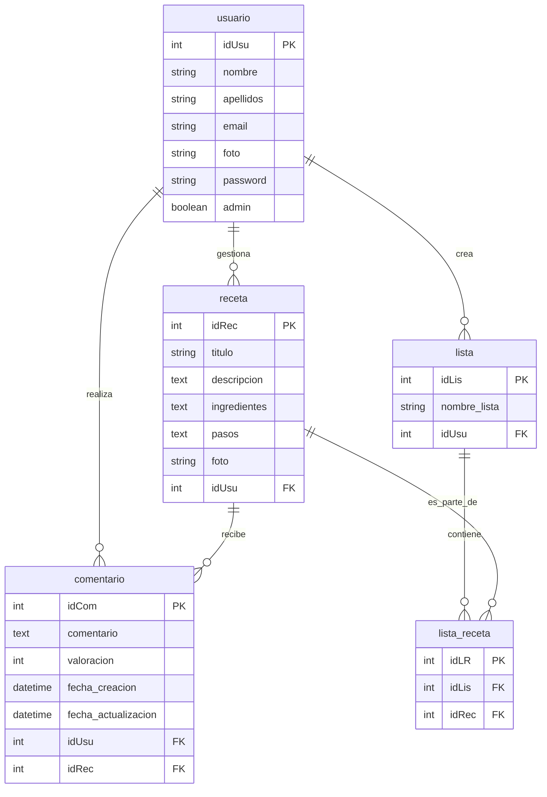
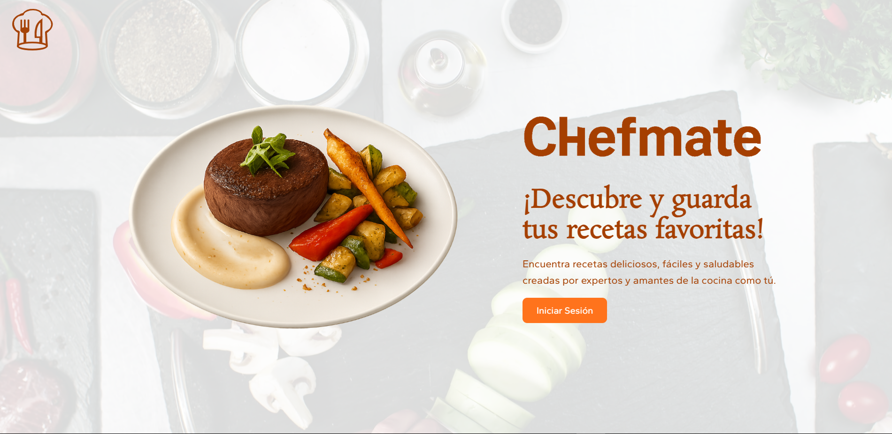
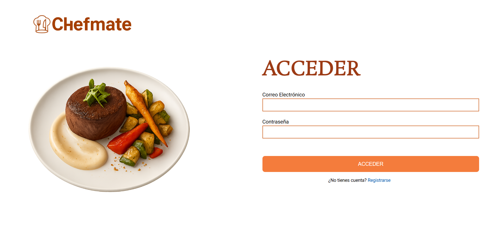
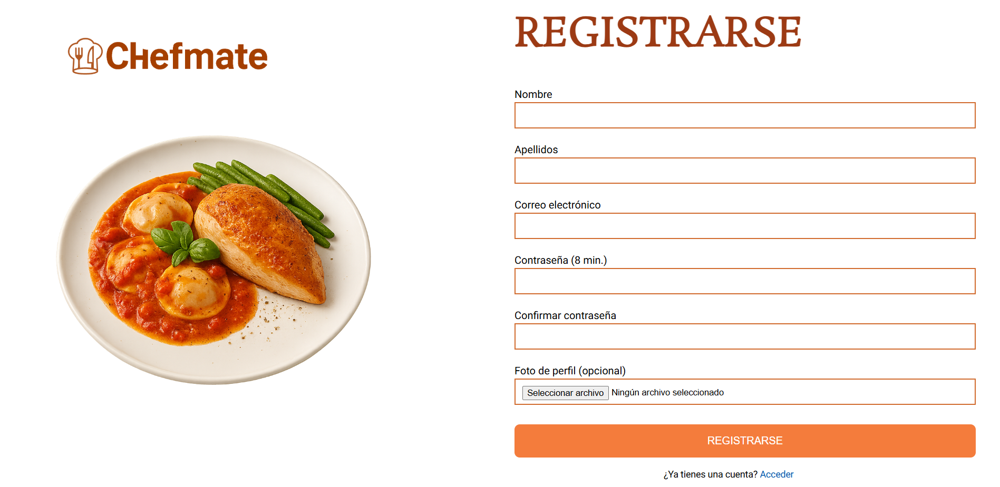
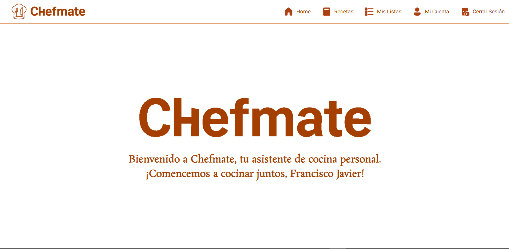
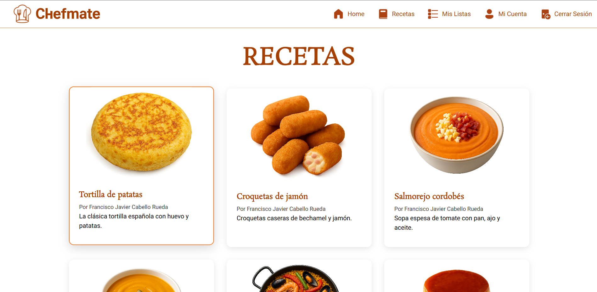
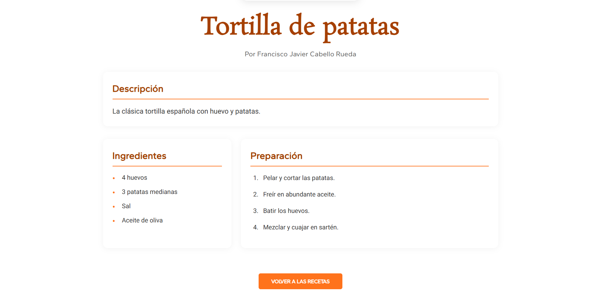
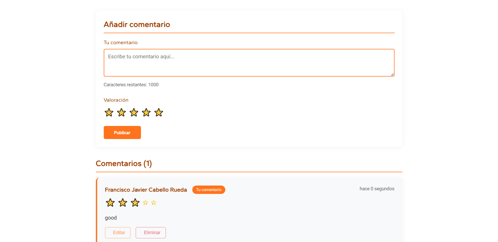
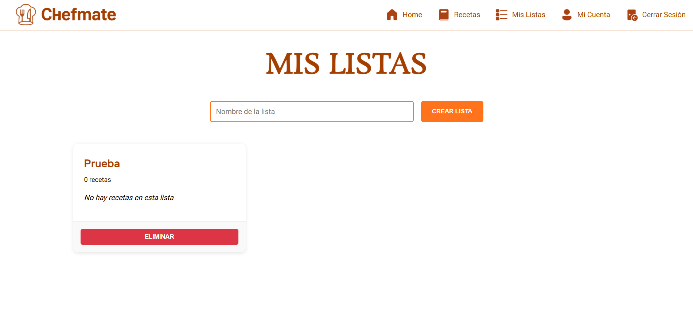
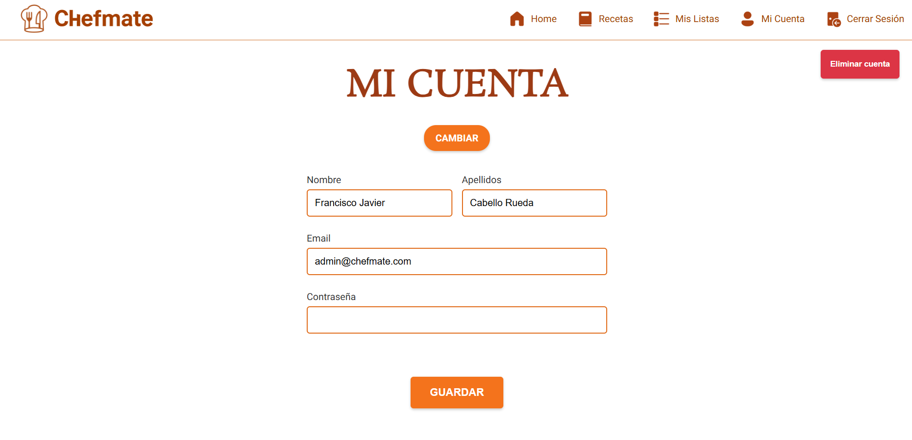

# 👨‍🍳 ChefMate  
## 🍲 **Tu Compañero de Cocina Digital**

Bienvenido a **ChefMate**, una plataforma web que conecta a amantes de la cocina, permitiéndole descubrir y organizar sus recetas favoritas de forma fácil e intuitiva.

## 🧑‍💻 Autor

**Francisco Javier Cabello Rueda**  
📬 *Desarrollador y amante de la cocina*

---

## 🔗 Funcionalidades principales

- 📚 Gestión completa de recetas
- 🔍 Sistema de búsqueda
- ⭐ Valoraciones mediante estrellas y comentarios
- 📋 Gestión de listas personalizadas de recetas

---

## 🎯 Objetivos del Proyecto

- Desarrollar una plataforma intuitiva para explorar, guardar y gestionar recetas.
- Implementar perfiles diferenciados para usuarios y administradores.
- Permitir valoraciones con estrellas y comentarios.
- Facilitar la búsqueda de recetas por nombre.
- Crear listas personalizadas de recetas por parte del usuario.

---

## 🛠️ Tecnologías Utilizadas

---

## 🗺️ Esquema Entidad-Relación

A continuación se presenta el modelo Entidad-Relación que representa la estructura de datos de ChefMate:

  
Diagrama-ER

---

## 📷 Tutorial de Uso

A continuación se muestra una guía rápida con capturas de pantalla para aprender a utilizar ChefMate:

  
Tutorial

- Empezamos en la landing-page, donde le daremos al boton de iniciar sesión para redirigirnos al login.  

  

- Una vez en el login podemos elegir entre acceder o crear una cuenta.  

  

  

- Ya logueados, nos redirigirá al home-page, donde podremos movernos a las distintas páginas.  

  

- En Recetas podremos acceder a los detalles de las diferentes recetas.  

  

- En los detalles podremos ver la receta completa y podremos ver y añadir comentarios en esta.  

  

  

- En Listas podremos ver, crear y eliminar nuestras listas.  

  

- En Mi Cuenta podremos ver, modificar o elimnar los datos de nuestra cuenta.  

  

---

## 🚀 URLs de Despliegue

- 🌐 **Aplicación web:** [https://chefmate.duckdns.org](https://chefmate.duckdns.org)
- 🛬 **Landing page:** [https://chefmate-landing.duckdns.org](https://chefmate-landing.duckdns.org)
- 📘 **Documentación de la API:** [https://chefmate-internal.duckdns.org/api/documentation](https://chefmate-internal.duckdns.org/api/documentation)
- 🔐 **Panel de administración:** [https://chefmate-internal.duckdns.org](https://chefmate-internal.duckdns.org)

---

## 🚀 URLs de Diseño

- 📄 **Documentación Diseño (PDF):** [Descargar Documento](documents/DOCUMENTACIÓN_DISEÑO.pdf)
- 🎨 **Diseño de la app (FigJam):** [Ver FigJam](https://www.figma.com/board/BKBY2Vp0fTQNLsQGXuFklK/FigJam-ChefMate?node-id=0-1&t=cAqT1LSTDQEYfMHu-1)
- 🎨 **Diseño de la app (Wireframe de Baja Fidelidad):** [Ver Wireframe de Baja Fidelidad](https://www.figma.com/design/mu8VlYibB3xOTgntQxgvBw/WireframeBajaFidelidad-ChefMate?node-id=3-13&t=cAqT1LSTDQEYfMHu-1)
- 🎨 **Diseño de la app (UI Kit):** [Ver UI Kit](https://www.figma.com/design/JC1AVQqRJXR6QNaOpZKd0d/UIKIT-ChefMate?node-id=0-1&t=cAqT1LSTDQEYfMHu-1)
- 🎨 **Diseño de la app (UI):** [Ver UI](https://www.figma.com/design/eQU3RIpH9npO8SkYLNuwy8/UI-ChefMate?node-id=3-1337&p=f&t=cAqT1LSTDQEYfMHu-0)

---

## 🧑‍🏫 Presentación del Proyecto

- 📄 **Presentación (PDF):** [Descargar Documento](documents/CHEFMATE.pdf)
- 🎥 **Vídeo explicativo (CheckPoint):** [Ver en Drive](https://drive.google.com/file/d/1mnCcmqk_xJqGdevsBif6E8Tpgr7mV8O5/view?usp=drive_link)
- 🎥 **Vídeo explicativo (YouTube):** [Ver en Drive](https://drive.google.com/file/d/1Q5Xe-TDc184jYcSJ4XwRtUP8rjHOT0D1/view?usp=drive_link)

---

## 🗂️ Bitácora de Tareas

  
Bitácora

| Fecha       | Tarea realizada                                         | Responsable                       |
|-------------|---------------------------------------------------------|-----------------------------------|
| 12/03/2025  | Creación del anteproyecto                               | Francisco Javier Cabello Rueda    |
| 15/03/2025  | Diseño del modelo entidad-relación                      | Francisco Javier Cabello Rueda    |
| 15/04/2025  | Diseño del Figjam y Wireframe de baja fidelidad         | Francisco Javier Cabello Rueda    |
| 19/04/2025  | Diseño de UI Kit y UI  de Figma                         | Francisco Javier Cabello Rueda    |
| 22/04/2025  | Despliegue de la BBDD, Hosted Zone y Security Groups    | Francisco Javier Cabello Rueda    |
| 24/04/2025  | Migraciones, seeders y factorias de Laravel             | Francisco Javier Cabello Rueda    |
| 26/04/2025  | Modelos y relaciones de laravel                         | Francisco Javier Cabello Rueda    |
| 28/04/2025  | Despliegue del Backend                                  | Francisco Javier Cabello Rueda    |
| 08/05/2025  | Landing Page                                            | Francisco Javier Cabello Rueda    |
| 11/05/2025  | Documentación del Diseño                                | Francisco Javier Cabello Rueda    |
| 13/05/2025  | Despliegue de la Landing-Page                           | Francisco Javier Cabello Rueda    |
| 15/05/2025  | Despliegue del Frontend                                 | Francisco Javier Cabello Rueda    |
| 17/05/2025  | Despliegue de Balanceadores de Carga                    | Francisco Javier Cabello Rueda    |
| 19/05/2025  | Controladores de la página de administración            | Francisco Javier Cabello Rueda    |
| 22/05/2025  | Vistas de Blade y rutas de Laravel                      | Francisco Javier Cabello Rueda    |
| 23/05/2025  | Internacionalización de laravel                         | Francisco Javier Cabello Rueda    |
| 26/05/2025  | API de laravel y autentificación con Sanctum            | Francisco Javier Cabello Rueda    |
| 29/05/2025  | Documentación de la API con Swagger                     | Francisco Javier Cabello Rueda    |
| 29/05/2025  | Documentación de la API con Swagger                     | Francisco Javier Cabello Rueda    |
| 02/06/2025  | Componentes Login, Registro y Home en el Frontend       | Francisco Javier Cabello Rueda    |
| 05/06/2025  | Componente Cuenta del Frontend                          | Francisco Javier Cabello Rueda    |
| 08/06/2025  | Componentes Receta y Receta-detalle del Frontend        | Francisco Javier Cabello Rueda    |
| 10/06/2025  | Componente Comentarios del Frontend                     | Francisco Javier Cabello Rueda    |
| 12/06/2025  | Componente Listas del Frontend                          | Francisco Javier Cabello Rueda    |

---

## 📚 Bibliografía / Recursos Utilizados

### 📦 Backend (Laravel)
- [Documentación Laravel](https://laravel.com/docs)
- [Librería Faker](https://fakerphp.org/)
- [Laravel Sanctum](https://laravel.com/docs/11.x/sanctum)
- [Laravel Breeze](https://laravel.com/docs/11.x/starter-kits#breeze)
- [Validación en Laravel](https://laravel.com/docs/11.x/validation)
- [Laravel File Storage](https://laravel.com/docs/11.x/filesystem)

### 📘 API & Swagger
- [OpenAPI Specification](https://swagger.io/specification/)
- [Laravel API Resources](https://laravel.com/docs/11.x/eloquent-resources)

### ☁️ Despliegue y AWS
- [Documentación CloudFormation](https://docs.aws.amazon.com/es_es/AWSCloudFormation/latest/UserGuide/Welcome.html)
- [AWS EC2](https://docs.aws.amazon.com/AWSEC2/latest/UserGuide/concepts.html)
- [Route 53](https://docs.aws.amazon.com/Route53/latest/DeveloperGuide/Welcome.html)

### 🐳 Docker y DevOps
- [Instalación Docker en Ubuntu](https://www.hostinger.com/es/tutoriales/como-instalar-y-usar-docker-en-ubuntu)
- [Imagen Docker de Laravel (YouTube)](https://www.youtube.com/watch?v=uYhowDSkwyk)
- [Dockerización de Angular (YouTube)](https://www.youtube.com/watch?v=B-ESQI4Z9Y8)

### 🌐 Frontend y JS
- [Documentación Angular](https://angular.io/docs)
- [Documentación AnimeJs](https://animejs.com/documentation/)
- [Documentación API Canvas](https://developer.mozilla.org/es/docs/Web/API/Canvas_API)
